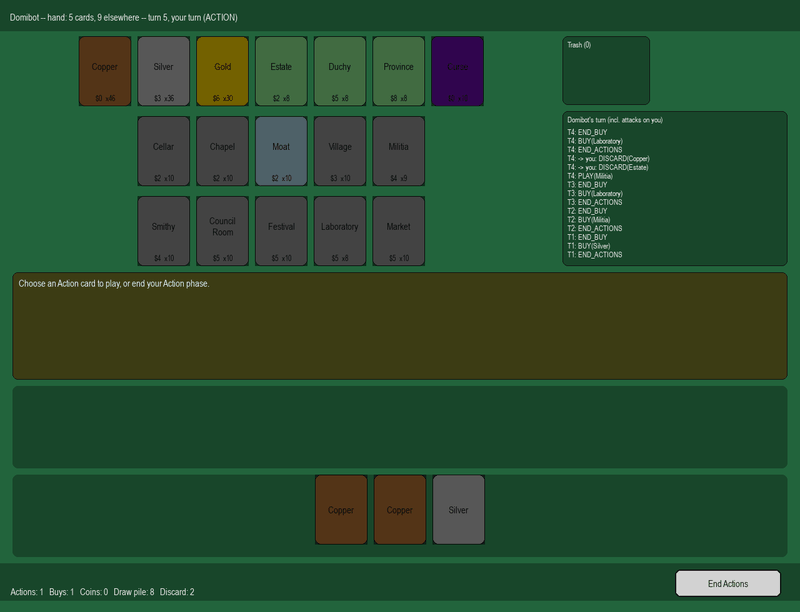

# domibot

A Dominion (base set) rules engine, and **domibot2.3**, a bot trained on it
with reinforcement learning (PPO). Play against it in a terminal or a
pygame window, or get its recommendations while you play a real game
online. Every point in the engine is one player choosing one action from an
explicit list of legal actions.



*The pygame GUI, recorded headlessly: a scripted Big Money player in the
human seat vs. Domibot. Its turn log (right) shows engine turns like
Laboratory → Laboratory → Militia.*

## Results

`domibot2.3`'s raw policy (no search), on random kingdoms, each played from
both seats:

| opponent | games | W–L–T | score (95% CI) |
|---|---|---|---|
| Big Money | 400 | 380–17–3 | 95.4% (93–97%) |
| Big Money + the kingdom's best terminal Action | 2000 | 1554–385–61 | 79.2% (77–81%) |
| `domibot2.2`, the previous release | 2000 | 965–938–97 | 50.7% (48–53%) |
| `domibot_v4.4`, the best AlphaZero-style checkpoint, searching the true game state (100 simulations per move) | 200 | 175–23–2 | 88.0% (83–92%) |

It's level with 2.2 head to head, but no longer loses a third of its games
to a simple Workshop/Gardens rush, as 2.2 did (it now wins 87% of them).
It plays multi-Action turns (Laboratory, Market and Sentry chains), but it
still doesn't use nine of the 26 kingdom cards, Throne Room and Village
among them. See [training/README.md](training/README.md) for how it was
trained and what's being tried next.


## Setup

```bash
git clone https://github.com/rafxrs/domibot.git
cd domibot
pip install -e ".[dev,train,gui]"
```

Python 3.10+. `train` pulls in `torch` (CPU build by default — see
`training/README.md`'s GPU section to install a CUDA build instead);
`gui` pulls in `pygame`. Drop either extra you don't need.

The trained model isn't in git (`checkpoints/` is gitignored). Download
`domibot2.3.pt` from the [Releases page](https://github.com/rafxrs/domibot/releases)
into `checkpoints/domibot2/`, where every script looks for it by default:

```bash
mkdir -p checkpoints/domibot2
curl -L -o checkpoints/domibot2/domibot2.3.pt https://github.com/rafxrs/domibot/releases/download/domibot2.3/domibot2.3.pt
```

## Play

```bash
python examples/play_vs_domibot.py          # against domibot2.3 in the terminal
python examples/play_vs_domibot.py --gui    # in a pygame window
python examples/play_vs_random.py [seed]    # against a random-move bot
python examples/play_domibot.py --games 20 --players 2   # watch it play itself (2-4 players)
python examples/domibot_relay.py            # its recommendations while you play a real game, e.g. on dominion.games
```

Training commands, the tools for measuring a checkpoint, and the relay
tool's details are in [training/README.md](training/README.md).

## Design: decisions as a generator, actions as a flat, typed choice

Every card effect that needs player input is a Python generator; `Game`
drives whichever one is currently suspended (`legal_actions()` returns the
pending `Decision`'s options, `step(action)` resumes it via
`generator.send`). Sub-effects (Throne Room, Vassal replaying a card)
compose with plain `yield from`; `attack_each_opponent` walks opponents in
turn order and inserts Moat's block-or-not automatically.

Variable-length selections (Cellar/Chapel/Militia/Sentry's trash/discard
steps) are a *sequence* of single-card-or-DONE decisions, not one
combinatorial "choose a subset" decision — keeps the legal-action count
bounded by hand size instead of 2^hand_size.

`Action` is a flat `(verb, card_or_None)` pair (`PLAY(Village)`,
`BUY(Silver)`, `TRASH(Copper)`, `DONE`) — hashable, usable directly as a
policy-network output token. `Decision.kind` (`PHASE_ACTION` /
`SELECT_CARD` / `YES_NO` / `REACT`) gives an encoder context for *why* a
verb is legal, since e.g. `YES`/`NO` is reused across unrelated effects
(Library's draw-or-skip, Vassal's play-or-not).

## Layout

Repo root: `src/domibot/` (the engine, below), `tests/`, `examples/` (CLI
scripts), `training/` (the RL layer, with its own README), `gui/` (the
pygame front-end behind `--gui`), `game_logs/` (gitignored, generated).

- `enums.py` — `CardType`, `Phase`, `DecisionKind`
- `models.py` — `Action`, `Decision`
- `card.py` — `Card` definition (cost, types, flat bonuses, optional effect)
- `player.py` — `PlayerState`: deck/hand/discard/play_area/set_aside zones
- `effects.py` — shared decision primitives (`choose_cards`, `choose_one`,
  `choose_from_supply`, `yes_no`, `attack_each_opponent`, `peek_top`, ...)
- `cards/basic.py` — Copper, Silver, Gold, Estate, Duchy, Province, Curse
- `cards/kingdom.py` — all 26 base-set kingdom cards and their effects
- `game.py` — `Game`: supply/turn setup, `legal_actions()`, `step()`,
  scoring, game-end conditions
- `gamelog.py` — format/save a game's `action_log` to a text or JSON file

## What's implemented

All 26 base-set kingdom cards plus the 7 basic cards, the full
Action/Buy/Cleanup turn, Moat reactions, supply setup for 2–4 players, and
both game-end conditions (Provinces gone, or any 3 supply piles empty).
`tests/test_game.py` covers the trickier cards (Moat blocking, Throne Room
composition, Bandit/Sentry/Library reveal order, Merchant's turn-scoped
bonus, Gardens) and random-plays every kingdom card to completion. Not
covered: other expansions, and more than 4 players.
