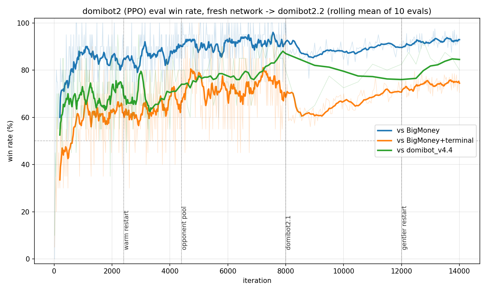

# training

The RL-facing layer on top of the `domibot` game engine, kept separate from
it: the engine has no opinion on how it gets trained against.

Two training approaches were built here, in order. **Phase 1** (MCTS
self-play, AlphaZero-style) never learned to chain action cards despite
five separate fix attempts, and was abandoned. **Phase 2** (PPO) is the
current approach and the strongest bot in the project. Both share the same
engine, encoding, and network.

## What's here

- **`encoding.py`** — fixed vocabularies: `CARD_NAMES`/`ACTION_VOCAB` (206
  actions any card effect can produce), `encode_observation` (a (419,)
  float32 vector that respects hidden info — opponents expose only their
  discard, play area, and hand/deck *sizes*), `encode_public_extras` (138
  more public features: scores, opponent card ownership, kingdom, empty
  piles), `legal_action_mask`.
- **`env.py`** — `DominionEnv`, a Gym-shaped masked-discrete-action wrapper
  around `Game`. Each `step` acts for whoever `Game.current_decider()` is;
  reward is sparse (0 until game end, then +1/-1/0).
- **`agents.py`** — the `Agent` protocol (`act(game) -> Action`) plus
  `RandomAgent`, `BigMoneyAgent`, and `DomibotAgent` (a network + MCTS).
- **`evaluate.py`** — `play_match(agent_a, agent_b, n_games)`, a head-to-head
  series across random kingdoms.
- **`network.py`** — `DomibotNet`, a residual MLP (observation → 256 wide ×
  4 blocks by default → policy logits (206) + tanh value), shared by both
  phases. Width, depth, and whether it reads the public extras are saved in
  each checkpoint.
- **`mcts.py`** — PUCT search, built for Phase 1's self-play loop; still
  used today as an inference-time search layer on top of Phase 2's network
  (the relay tool runs it that way).
- **`self_play.py` / `train.py` / `heuristics.py`** — Phase 1's self-play
  loop, training loop, and non-learned sub-decision fallback.
- **`ppo/`** — Phase 2's rollout collection, GAE, training loop, and
  distillation into a larger network.
- **`relay.py` / `log_parser.py`** — the real-game move advisor (below).

## GPU

`get_device()` uses CUDA automatically once torch is installed against a
CUDA index (plain `pip install torch` grabs the CPU-only build):

```bash
pip install --force-reinstall torch --index-url https://download.pytorch.org/whl/cu130
```

If that tag doesn't have kernels for your GPU, `torch.cuda.is_available()`
can still say `True` and only fail at actual kernel launch — confirm with:

```bash
python -c "import torch; x = torch.randn(2048, 2048, device='cuda'); print((x @ x).sum().item())"
```

## Phase 1: MCTS self-play (AlphaZero-style) — abandoned

**What it was.** `mcts.py`'s PUCT search driving `self_play.py`'s self-play
loop and `train.py`'s training loop: the standard AlphaZero recipe (policy
trained against MCTS visit counts, value against game outcomes). It
searched and learned *every* decision uniformly — phase actions and
card-effect sub-decisions (Chapel's trashes, Militia's forced discard, ...)
alike. A node's position is a `(boundary, path)` pair rather than a raw
`Game`, since card effects are suspended generators that `Game.clone()`
can't safely copy; `materialize()` replays `path` from `boundary` on
demand, which is deterministic because every random draw goes through
`Game.rng`.

**Checkpoint lineage and results** (`checkpoints/domibot1/domibot_vX.Y.pt`):

| Checkpoint | What changed | Key measured result |
|---|---|---|
| v1.x | original network | ~68% vs BigMoney in its in-training eval; never chains actions |
| v2.x | fresh net, action-continuation bias (nudges self-play toward chaining instead of ending the phase) from iter 1 — retrofitting it onto v1.4 had zero effect | v2.1 beat v1.4 71-27-2 with real multi-card engine turns; v2.2 beat v2.1 57-36-7 |
| v3.x | sub-decisions searched via MCTS instead of a fixed heuristic (much harder decision space), curriculum kingdom sampling, then multi-determinization search to fix "strategy fusion" (each self-play search only explored the *one* hidden deal a game actually had) | ~17% → 35% (28/80 games) vs v2.2 over 7 versions; spams Militia (needs no sub-decision), avoids chaining |
| v4.1 | fresh net after an audit found 3 engine bugs (game-end timing, indistinguishable same-shape decisions, invisible mid-effect cards), plus LR decay | 11/60 vs BigMoney — a regime fix, not a power play |
| v4.2-v4.3 | warm-restart LR cycles | 35/60 peak; v4.2 never plays two action cards in a turn |
| v4.4 | `action_bias` x2.75 (no effect); TD-bootstrapped value targets + opponent pool | 40/60 vs BigMoney, 36/60 vs BigMoney+terminal; still never chains |
| (unpromoted) | same TD+pool recipe, fresh network | 21–36–3 vs BigMoney, 15–44–1 vs +terminal (60 games each); still no chaining — rules out entrenchment as the cause |
| domibot2.1 | Phase 2: PPO + GAE, no tree search | 351–43–6 vs BigMoney (400 games), 159–36–5 vs v4.4 (200 games); real multi-action engine turns |
| **domibot2.2** | **PPO resumed with 4x the games per update and a quarter of the learning rate** | **1130–797–73 vs domibot2.1 (2000 games); 367–26–7 vs BigMoney (400), 169–30–1 vs v4.4 (200)** |

**Why it failed.** It plateaued at Big Money + Witch: from v4.2 on, the
question wasn't win rate but whether it ever discovers multi-step strategy,
and nothing tried made it, even fixes aimed squarely at the diagnosis
below. Every MCTS value target is a Monte-Carlo return (or a short
TD-bootstrap of one), which buries a deferred-payoff card's credit under a
whole game's noise; and pure self-play only has to beat itself, so a
half-built engine reliably loses to tuned Big Money with nothing rewarding
the climb to a well-executed one. Five separate conditions, one
conclusion: it needed a different algorithm, not another patch.

**Running it** (still works, no longer the recommended path):

```bash
python -m training.train
```

Key flags (see `--help`): `--iterations`, `--games-per-iter`,
`--simulations` (MCTS sims/move), `--action-bias`, `--eval-every`,
`--eval-games`, `--reference-checkpoint <path>`, `--checkpoint <path>` to
resume. Checkpoints land in `checkpoints/`. `--parallel-games` batches leaf
evaluations across concurrent games; past some point the unbatched Python
game engine, not the network, becomes the bottleneck.

## Phase 2: PPO — the current bot

**Why PPO.** GAE gives dense, bootstrapped credit to *every* decision from a
real value function, fixing Phase 1's credit-assignment problem
structurally, and needs no tree search at data-generation time — so it's
also ~250x faster per iteration.

**Reused from Phase 1 unchanged**: the `domibot` engine, `encoding.py`,
`network.DomibotNet`, `env.DominionEnv` (gained one addition, an optional
`reward_fn`), `evaluate.py`/`agents.py`, and `mcts.py` (now an
inference-time search layer, used by the relay tool on top of PPO-trained
networks).

**New `ppo/` subpackage**: `gae.py` (`compute_gae`, generalizing
`self_play._backfill_value_targets`'s per-decider pattern to full GAE),
`rollout.py` (`collect_rollouts`: N `DominionEnv` instances stepped side by
side sharing one batched forward pass per round — no MCTS tree, so no
`boundary`/`path`/`materialize` needed; `collect_cross_play_rollouts` for an
opponent pool), `train.py` (clipped surrogate, value MSE, entropy bonus,
advantage normalization, cosine LR decay), `distill.py` (copies a trained
network into a larger one, below). Tests: `tests/test_ppo.py`.

**Running it**:

```bash
python -m training.ppo.train
```

Key flags (see `--help`): `--iterations`, `--games-per-iter`,
`--lr`/`--lr-final-frac` (cosine LR decay), `--entropy-coef` (PPO's
exploration driver), `--opponent-pool-size`/`--opponent-pool-frac`,
`--eval-every`/`--eval-games`, `--eval-reference-checkpoint <path>` (a fixed
MCTS checkpoint as a second eval opponent, via real search;
`--eval-reference-every` lets it run less often than the cheap BigMoney
evals, since it otherwise dominates wall-clock time), `--checkpoint <path>`
to resume (a fresh network's size is `--hidden-dim`/`--num-blocks`).
Checkpoints land in `checkpoints/domibot2/` as `<run-name>_latest.pt` plus
a `<run-name>_iter_N.pt` snapshot every eval; `--run-name` defaults to
`domibot2`.

A longer run, resumed from the current strongest checkpoint with the
settings that produced it and backgrounded with its output logged to a
file. Resuming a trained policy at a higher learning rate or with smaller
batches erodes it first (see "Restarting PPO without losing strength"
below):

```bash
python -m training.ppo.train \
    --checkpoint checkpoints/domibot2/domibot2.2.pt --start-iteration 14001 \
    --iterations 2000 --games-per-iter 256 --minibatch-size 1024 \
    --lr 5e-5 --lr-final-frac 0.1 --target-kl 0.02 \
    --eval-every 25 --eval-games 200 \
    --eval-reference-checkpoint checkpoints/domibot1/domibot_v4.4.pt --eval-reference-every 250 \
    > logs/domibot2/my_run.log 2>&1 &
```

`python -m training.ppo.plot_eval logs/domibot2/my_run.log` graphs eval win
rate vs iteration (needs `pip install -e ".[plot]"`). Pass several logs to
merge a resumed run into one history; `--smooth N` plots a rolling mean,
`--vline ITER:LABEL` marks an event. `docs/training_curve.png` is:

```bash
python -m training.ppo.plot_eval logs/domibot2/domibot2_stage1_run{1,2,3,3b}.log \
    logs/domibot2/domibot2_stage3_pool_run1.log logs/domibot2/domibot2.2_run1.log \
    logs/domibot2/domibot2_256x4_control_run1.log --no-trend --smooth 10 \
    --vline "2400:warm restart" --vline "4400:opponent pool" \
    --vline "8000:domibot2.1" --vline "12000:gentler restart" \
    --title "domibot2 (PPO) eval win rate, fresh network -> domibot2.2 (rolling mean of 10 evals)" \
    --out docs/training_curve.png
```

**Training arc** (fresh network through 14000 iterations; promoted
checkpoints are named `domibotN.M.pt`, with logs/checkpoints under
`logs/domibot2/` and `checkpoints/domibot2/`). In-training evals are 20
games each through iteration 8000 (single points noisy, ±~20pp) and 200
after, on different kingdoms each time; the curve below is a rolling mean.
Promotion decisions use larger evals on fixed seeds, given below.



- **1-400**: default hyperparameters, under an hour. `iter_400` chains
  actions on 62/218 turns (28%) on a Witch-free engine-rich test kingdom
  (up to 5 plays deep) — something no MCTS checkpoint ever showed — and
  beat `domibot_v4.4.pt` 30–28–2 over 60 games.
- **401-4400**: plateaued by 2400 (flat win-rate trend, entropy decaying).
  A warm restart (LR decay + `entropy_coef` 0.01→0.03) broadened chaining
  specifically where it was weakest (Witch kingdom: 7% → 20% of turns,
  40/198). Final eval: 17/20, 15/20, 16/20 games vs BigMoney,
  BigMoney+terminal, `domibot_v4.4.pt`.
- **4401-8000**: an opponent pool (30% of games vs. a frozen recent
  checkpoint) was a wash — chaining moved in opposite directions on the two
  test kingdoms (Witch: 20% → 13%, 32/244 turns; Witch-free: 24% → 28%,
  58/209), likely because the pool's snapshots were too recent to add real
  diversity. Final eval: 20/20, 13/20, 16/20.

`iter_8000` is promoted as **`domibot2.1.pt`**, the strongest checkpoint
until `domibot2.2` (superseding an earlier interim promotion of `iter_400` under
the same name). A larger post-hoc eval (raw policy, no search, paired random
kingdoms): 351–43–6 vs BigMoney and 286–103–11 vs BigMoney+terminal over
400 games each, and 159–36–5 vs `domibot_v4.4.pt` (100-sim MCTS) over 200. Download it from the
[Releases page](https://github.com/rafxrs/domibot/releases).

**domibot2.2 attempt (8001-12000): no measurable gain.** Resumed from
`domibot2.1.pt` with four changes, all still in the code:

- *Win-weighted reward* (`--reward-win-weight 0.8`, now the default): 0.8 ×
  win/loss + 0.2 × the old tanh margin. Margin alone scored a 1-point win
  and a 1-point loss as +0.1 and -0.1, so the win/loss line barely
  registered, and 61% of `domibot2.1`'s losses to BigMoney+terminal were
  within 6 VP.
- *Public score features* (`--public-features`, default on):
  `encoding.encode_public_extras` adds both players' VP and the lead,
  opponent card ownership, kingdom membership, and empty piles — all
  visible at a real table, but left for the network to reconstruct before.
  They enter a trained network through a zero-initialized input layer
  (`DomibotNet.with_extra_inputs`), so its outputs are unchanged until it
  learns to use them.
- *Forced-move masking*: ~42% of decisions have exactly one legal action,
  hence no policy gradient. They're left out of the policy and entropy
  terms and the advantage normalization, but still train the value head.
- *KL logging and `--target-kl`*: approximate KL and clip fraction per
  update, and an optional per-epoch early stop.

It ran 4000 iterations at `--lr 2e-4 --lr-final-frac 0.1 --entropy-coef
0.01 --target-kl 0.02` with 200-game evals (`logs/domibot2/domibot2.2_run1.log`;
a first try at `--entropy-coef 0.02` was aborted when entropy doubled and
win rate fell). Win rate vs BigMoney+terminal fell from 74% at the first
eval to ~60% for the next ~1500 iterations and only recovered as the
learning rate decayed; the tuning below explains why. The final
checkpoint, `domibot2_iter_12000.pt`, is no stronger than `domibot2.1`:
1005–921–74 head-to-head over 2000 games (52.1%, 95% CI 49.9–54.3%), and
72.7% vs 72.0% against BigMoney+terminal on the same 2000 games. Not
promoted.

**Larger network, via distillation.** The 2.2 result suggested the 256×4
network had plateaued, so the next experiment is a 512 wide × 6 block
network (3.7M parameters, up from 0.76M). Training that from scratch would
repeat the 8000 iterations it took to reach `domibot2.1` before the extra
capacity could matter, so `ppo/distill.py` first trains it to copy
`domibot2_iter_12000.pt` — as strong as `domibot2.1`, already trained on
the current reward, and reads the public features:

- Data is DAgger-style: the teacher plays the first 30% of iterations;
  after that the student plays and the teacher labels the positions the
  student reaches, which is where an imitator's mistakes compound.
- Loss: KL(teacher ‖ student) over legal actions on non-forced decisions,
  plus MSE to the teacher's value.
- Progress is measured on each fresh batch *before* training on it
  (held-out KL, top-1 agreement with the teacher), and every 50 iterations
  by 200 games vs the teacher and vs BigMoney+terminal.

```bash
python -m training.ppo.distill \
    --teacher checkpoints/domibot2/domibot2_iter_12000.pt \
    --hidden-dim 512 --num-blocks 6 --iterations 400 \
    --out checkpoints/domibot2/domibot2_512x6_distilled.pt
```

It took 400 iterations, ~20 minutes
(`logs/domibot2/domibot2_512x6_distill.log`). Held-out top-1 agreement
with the teacher rose from 41% before any training to 94% by iteration 50
and 97.7% by the end. The student drew the teacher 99–96–5 over the final
200 games, and won 139/200 vs BigMoney+terminal (the teacher scores ~72%).
PPO then resumes from it (the size is read from the checkpoint). The
tradeoff: the student starts inside the teacher's strategy and only
leaves it if PPO finds something better.

**Restarting PPO without losing strength.** The first two attempts to
resume from the distilled network failed the same way: policy entropy
climbed and win rate fell. At the 2.2 run's `--lr 2e-4` the larger
network's policy moved ~3x further per update than the 256×4 one's had
(approximate KL 0.041 vs 0.013). At 1e-4, entropy went 0.15 → 0.42 and
BigMoney+terminal fell to 128/200 within 50 iterations. Both were stopped
(their logs weren't kept).

The 2.2 run had the same signature: entropy rose from ~0.18 to ~0.30 over
its first few hundred iterations while win rate fell, and both recovered
only as the learning rate decayed. A policy that finished its last run at
a low learning rate is sharp. Restarting it at a high one adds parameter
noise, which pushes a near-deterministic policy's entropy up whatever the
entropy bonus is, and its greedy play gets worse until the decay sharpens
it again. The 2.2 run spent most of its 4000 iterations getting back to
where it started.

Six short probes from the distilled network separated the causes
(`logs/domibot2/domibot2_512x6_probe_{A..F}.log`). A–D ran 100 iterations
of 64 games; E–F ran 50 of 256, with 4x the minibatch size. Entropy is the
mean over the first and last quarter of each probe; evals are 200 games at
the midpoint and the end.

| probe | lr | games/iter | entropy coef | entropy | vs BigMoney+terminal |
|---|---|---|---|---|---|
| A | 1e-4 | 64 | 0.003 | 0.22 → 0.32 | 116, 126 |
| B | 5e-5 | 64 | 0.01 | 0.24 → 0.43 | 126, 106 |
| C | 5e-5 | 64 | 0.003 | 0.19 → 0.35 | 116, 123 |
| D | 2e-5 | 64 | 0.01 | 0.17 → 0.23 | 133, 139 |
| E | 1e-4 | 256 | 0.01 | 0.20 → 0.34 | 130, 122 |
| F | 5e-5 | 256 | 0.01 | 0.16 → 0.26 | 135, 143 |

A smaller entropy bonus barely helps (B vs C), so the bonus isn't what
drives the drift. A lower learning rate slows it (B → D). A 4x larger
batch helps at 5e-5 (B → F) but not at 1e-4 (E). F held strength over its
50 iterations, so the first long run used it.

**First long run: the drift came back.** F's settings with cosine decay to
10%, for 2000 iterations of 256 games. Since the recipe changed along with
the network, the same recipe also ran on the 256×4
`domibot2_iter_12000.pt` as a control (`--run-name` keeps their checkpoint
files apart). By iteration ~12650 the two had split:

| | 512×6 | 256×4 control |
|---|---|---|
| entropy | 0.22 → 0.55–0.64 | ~0.12, flat |
| vs BigMoney+terminal (last 15 evals) | ~57% | 73.4% |
| vs `domibot_v4.4` (40 games at 12250, 12500) | 33, then 24 | 35, then 33 |
| approximate KL per update | 0.018 | 0.001 |

The 512×6 run was stopped there (`logs/domibot2/domibot2_512x6_run1.log`).

**The cause: refitting each batch.** PPO makes several passes over each
batch (`--epochs-per-update`, default 4), and every decision in it carries
a noisy advantage. The larger network can fit that noise position by
position (its surrogate loss went ~6x lower than the control's), and
fitting noise moves the policy in random directions, which shows up as
rising entropy. The 256×4 network can't fit it as well and averages it
out instead. Two more probes varied only the number of passes, at F's
settings for 100 iterations (`logs/domibot2/domibot2_512x6_probe_{G,H}.log`):

| passes per batch | entropy, iteration 25 → 100 | vs BigMoney+terminal (evals at 25/50/75/100) |
|---|---|---|
| 4 (the stopped run) | 0.22 → 0.41 | 141, 135, 128, 121 |
| 2 | 0.15 → 0.20 | 136, 133, 148, 144 |
| 1 | 0.13, flat | 147, 141, 134, 147 |

**Second long run.** One pass per batch, otherwise the same; the control
keeps running unchanged:

```bash
python -m training.ppo.train \
    --checkpoint checkpoints/domibot2/domibot2_512x6_distilled.pt --run-name domibot2_512x6e1 \
    --iterations 2000 --games-per-iter 256 --minibatch-size 1024 --epochs-per-update 1 \
    --start-iteration 12001 --lr 5e-5 --lr-final-frac 0.1 --entropy-coef 0.01 --target-kl 0.02 \
    --eval-every 25 --eval-games 200 \
    --eval-reference-checkpoint checkpoints/domibot1/domibot_v4.4.pt \
    --eval-reference-every 250 --eval-reference-games 40 \
    > logs/domibot2/domibot2_512x6_run2_1epoch.log 2>&1 &
```

The control uses 4 passes, `--checkpoint
checkpoints/domibot2/domibot2_iter_12000.pt --run-name domibot2_256x4`,
and logs to `logs/domibot2/domibot2_256x4_control_run1.log`. It also
differs from the 2.2 run (4x the games per update, a quarter of the
learning rate), so it tests whether a gentler restart alone helps the
256×4 network.

**Results.** Both runs finished 2000 iterations. Their final checkpoints
were evaluated on the same seeds as `domibot2.1`, raw policy with no
search (`logs/domibot2/*_iter_14000_eval.log`; 95% CIs in parentheses):

| | 256×4 control | 512×6, one pass | `domibot2.1` |
|---|---|---|---|
| vs `domibot2.1` (2000 games) | 1130–797–73, 58.3% (56.2–60.5%) | 1137–776–87, 59.0% (56.9–61.2%) | — |
| vs BigMoney+terminal (2000) | 76.8% (75.0–78.6%) | 76.1% (74.2–78.0%) | 72.0% (70.0–74.0%) |
| vs BigMoney (400) | 92.6% | 91.4% | 88.5% |
| vs `domibot_v4.4` (200) | 84.8% | 85.2% | 80.8% |

Head-to-head, the two drew: 963–957–80 over 2000 games (50.1%, 95% CI
48.0–52.3%). So:

- **The gain came from the gentler restart, not the size.** The 256×4
  control, resumed from `domibot2_iter_12000.pt` with 4x the games per
  update and a quarter of the 2.2 attempt's learning rate, beat
  `domibot2.1` 58–42. The 2.2 attempt's higher learning rate spent its
  4000 iterations recovering from its own restart instead.
- **5x the parameters bought nothing measurable**, and the larger network
  was harder to train: it needed one pass per batch to stop fitting
  advantage noise.

The control's final checkpoint, `domibot2_256x4_iter_14000.pt`, is
promoted as **`domibot2.2.pt`**: as strong as the 512×6 network, a fifth
the size, and faster for the relay tool's search. Download it from the
[Releases page](https://github.com/rafxrs/domibot/releases).

**Playing against / evaluating it**:

```python
import torch
from training.agents import DomibotAgent, BigMoneyAgent
from training.evaluate import play_match
from training.network import DomibotNet, get_device

device = get_device()
network = DomibotNet.load("checkpoints/domibot2/domibot2.2.pt", map_location=device).to(device)
domibot = DomibotAgent(network, num_simulations=200, device=device)

print(play_match(domibot, BigMoneyAgent(), n_games=50))
```

**Testing against real people** — `examples/domibot_relay.py` is a move
advisor for a real game you play yourself (e.g. on dominion.games); no
clicks are automated. `relay.py` reconstructs a `Game` from exactly what's
visible at the table (your own hand/total ownership exactly; the opponent's
discard and hand/deck *sizes*, never contents), filling in what's genuinely
hidden via determinization, then runs MCTS on top of the network.
`log_parser.py` does a full turn-by-turn replay of a pasted dominion.games
log to derive everything automatically, so the common case skips straight
to the recommendation. Anything it can't follow exactly (a bare, unnamed
"a card" in your own lines, or a line it doesn't recognize) stops the
replay, and the tool falls back to manual entry pre-filled with whatever it
did derive; so does a derived state that doesn't add up. Besides phase
decisions it covers the choices a log can leave pending:
- **your own card, mid-effect** (what Chapel trashes, what Throne Room
  plays, whether to play what Vassal discarded, Remodel/Mine/Workshop/
  Artisan gains, Sentry, Harbinger, Poacher, Cellar): `relay.replay_open_play`
  replays the card through the engine with your deck stacked with the cards
  the log shows you drawing, plus every choice the log already shows. A
  choice made in several steps with nothing new revealed in between is
  shown as the whole sequence.
- **the opponent's attack**: Militia's discard, Bureaucrat's topdeck,
  Bandit's trash, and whether to reveal Moat.

Cards known to be on top of a deck (Sentry/Harbinger/Artisan topdecks,
Bureaucrat's Silver) are placed there rather than shuffled in.
`tests/test_log_parser_edge_cases.py` replays five real games (one with
heavy Throne Room + Vassal chains) and requires every point a paste could
end at to parse and reconstruct.

Still unverified against real logs, so handled defensively: your own
Library (its set-aside lines stop the replay), whether dominion.games logs
Merchant's +$1 separately from the treasure line, and the exact Moat-reveal
wording. Not covered: a reaction to a Throne-Roomed attack or to one played
after the opponent's Council Room, a card whose draws reshuffle your deck
mid-effect, the order two Sentry cards go back in, and games with more than
two players.

```bash
python examples/domibot_relay.py --checkpoint checkpoints/domibot2/domibot2.2.pt --simulations 400
```

**Not yet done**: a privileged (full-information) critic, a more varied
opponent pool (older checkpoints, scripted strategies), and continuing
from `domibot2.2` with its own recipe to see where it plateaus.
